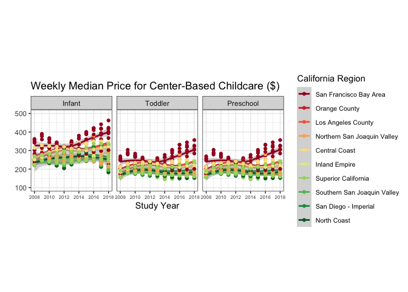

# Lab 6
Quinn Lynas

## The Data

In this lab we’re going look at the median weekly cost of childcare in
California. A detailed description of the data can be found
[here](https://github.com/rfordatascience/tidytuesday/blob/master/data/2023/2023-05-09/readme.md).

The data come to us from
[TidyTuesday](https://github.com/rfordatascience/tidytuesday).

**0. Load the appropriate libraries and the data.**

``` r
library(tidyverse)
```

    ── Attaching core tidyverse packages ──────────────────────── tidyverse 2.0.0 ──
    ✔ dplyr     1.1.4     ✔ readr     2.1.5
    ✔ forcats   1.0.0     ✔ stringr   1.5.1
    ✔ ggplot2   3.5.1     ✔ tibble    3.2.1
    ✔ lubridate 1.9.4     ✔ tidyr     1.3.1
    ✔ purrr     1.0.2     
    ── Conflicts ────────────────────────────────────────── tidyverse_conflicts() ──
    ✖ dplyr::filter() masks stats::filter()
    ✖ dplyr::lag()    masks stats::lag()
    ℹ Use the conflicted package (<http://conflicted.r-lib.org/>) to force all conflicts to become errors

``` r
childcare_costs <- read_csv('https://raw.githubusercontent.com/rfordatascience/tidytuesday/master/data/2023/2023-05-09/childcare_costs.csv')
```

    Rows: 34567 Columns: 61
    ── Column specification ────────────────────────────────────────────────────────
    Delimiter: ","
    dbl (61): county_fips_code, study_year, unr_16, funr_16, munr_16, unr_20to64...

    ℹ Use `spec()` to retrieve the full column specification for this data.
    ℹ Specify the column types or set `show_col_types = FALSE` to quiet this message.

``` r
counties <- read_csv('https://raw.githubusercontent.com/rfordatascience/tidytuesday/master/data/2023/2023-05-09/counties.csv')
```

    Rows: 3144 Columns: 4
    ── Column specification ────────────────────────────────────────────────────────
    Delimiter: ","
    chr (3): county_name, state_name, state_abbreviation
    dbl (1): county_fips_code

    ℹ Use `spec()` to retrieve the full column specification for this data.
    ℹ Specify the column types or set `show_col_types = FALSE` to quiet this message.

**1. Briefly describe the dataset (~ 4 sentences). What information does
it contain?**

> Childcare costs is a huge dataset that contains information from
> counties in the U.S. There is information about unemployment rates,
> labor force participation, poverty rates, county flip codes, median
> household earnings, and more. Child healthcare costs are included as
> well. The county dataset has county flip codes, county name, state
> name, and state abbreviation. We can join these two datasets with the
> flip codes, so that we have names instead of numbers to represent each
> county.

## California Childcare Costs

Let’s start by focusing only on California.

**2. Create a `ca_childcare` dataset of childcare costs in California,
containing (1) county information and (2) just the year and childcare
cost variable information from the `childcare_costs` dataset.**

*Hint: There are 58 counties in CA and 11 years in the dataset.
Therefore, your new dataset should have 53 x 11 = 638 observations. The
final data set should have study year, median household income expressed
in 2018 dollars, all the variables associated with full-time median
price charged for Center-based Care, and California county names*

``` r
ca_childcare <- childcare_costs |>
  left_join(counties, by = join_by(county_fips_code)) |>
  filter(state_name == "California") |>
  select(study_year, mhi_2018, mcsa, mc_toddler, mc_infant, mc_preschool, county_name)
```

**3. Using a function from the `forcats` package, complete the code
below to create a new variable where each county is categorized into one
of the [10 Census regions](https://census.ca.gov/regions/) in
California. Use the Region description (from the plot), not the Region
number. An example region has been started for you.**

*Hint: This is probably a good place to use ChatGPT to reduce on tedious
work. But you do need to know how to prompt ChatGPT to make it useful!*

``` r
ca_childcare <- ca_childcare |> 
  mutate(county_name = str_remove(county_name, " County")) |> 
  mutate(region = fct_collapse(county_name,
    'Superior California' = c("Butte", "Colusa", "El Dorado", "Glenn", "Lassen", "Modoc", "Nevada", "Placer", "Plumas", "Sacramento", "Shasta", "Sierra", "Siskiyou", "Sutter", "Tehama", "Yolo", "Yuba"),
    'North Coast' = c("Del Norte", "Humboldt", "Lake", "Mendocino", "Napa", "Sonoma", "Trinity"),
    'San Francisco Bay Area' = c("Alameda", "Contra Costa", "Marin", "San Francisco", "San Mateo", "Santa Clara", "Solano"),
    'Northern San Joaquin Valley' = c("Alpine", "Amador", "Calaveras", "Madera", "Mariposa", "Merced", "Mono", "San Joaquin", "Stanislaus", "Tuolumne"),
    'Central Coast' = c("Monterey", "San Benito", "San Luis Obispo", "Santa Barbara", "Santa Cruz", "Ventura"),
    'Southern San Joaquin Valley' = c("Fresno", "Inyo", "Kern", "Kings", "Tulare"),
    'Inland Empire' = c("Riverside", "San Bernardino"),
    'Los Angeles County' = "Los Angeles",
    'Orange County' = "Orange",
    'San Diego - Imperial' = c("San Diego", "Imperial")
    ))
```

**4. Let’s consider the median household income of each region, and how
that income has changed over time. Create a table with ten rows, one for
each region, and two columns, one for 2008 and one for 2018. The cells
should contain the `median` of the median household income (expressed in
2018 dollars) of the `region` and the `study_year`. Arrange the rows by
2018 values.**

``` r
# Hint: You will want to calculate the median of median income before you make columns for 2008/2018 by transforming the data

ca <- ca_childcare |>
  filter(study_year %in% c(2008, 2018)) |>
  group_by(region, study_year) |>
  summarize(median = median(mhi_2018)) |>
  pivot_wider(names_from = study_year, values_from = median)
```

    `summarise()` has grouped output by 'region'. You can override using the
    `.groups` argument.

``` r
colnames(ca) = list("region", "med_2008", "med_2018")
ca |>
  arrange(desc(med_2018))
```

    # A tibble: 10 × 3
    # Groups:   region [10]
       region                      med_2008 med_2018
       <fct>                          <dbl>    <dbl>
     1 San Francisco Bay Area        90412.  104552 
     2 Orange County                 86452.   85398 
     3 Central Coast                 72979    74849 
     4 Los Angeles County            63471.   64251 
     5 Inland Empire                 65977.   62056 
     6 San Diego - Imperial          58201.   60344.
     7 Northern San Joaquin Valley   59108.   57769 
     8 Superior California           57831.   53270 
     9 Southern San Joaquin Valley   52676.   52479 
    10 North Coast                   47862.   45528 

**5. Which California `region` had the lowest `median` full-time median
weekly price for center-based childcare for infants in 2018? Does this
`region` correspond to the `region` with the lowest `median` income in
2018 that you found in Q4?**

*Hint: The code should give me the EXACT answer. This means having the
code output the exact row(s) and variable(s) necessary for providing the
solution. Consider the `slice()` functions.*

``` r
ca_childcare |>
  filter(study_year == 2018) |>
  group_by(region) |>
  summarize(med_inf = median(mc_infant)) |>
  slice_min(med_inf)
```

    # A tibble: 1 × 2
      region              med_inf
      <fct>                 <dbl>
    1 Superior California    215.

> This region does not correspond with the one we found in question 4.

**6. Recreate the plot (look at online instructions) that shows, for all
ten regions, the change over time of the full-time median price for
center-based childcare for infants, toddlers, and preschoolers. Recreate
the plot. You do not have to replicate the exact colors or theme, but
your plot should have the same content, including the order of the
facets and legend, reader-friendly labels, axes breaks, and a smooth
function.**

``` r
longer_ca_childcare <- pivot_longer(ca_childcare, cols = c(mc_toddler, mc_infant, mc_preschool), names_to = "level") |>
  rename(median_price = value) |>
  mutate(level = case_when(
    level == "mc_infant" ~ "Infant",
    level == "mc_preschool" ~ "Preschool",
    level == "mc_toddler" ~ "Toddler"
  ))

longer_ca_childcare |>
  ggplot(aes(x = study_year, y = median_price, color = factor(region, levels = c("San Francisco Bay Area", "Orange County", "Los Angeles County",
                                                                                 "Northern San Joaquin Valley", "Central Coast", "Inland Empire",
                                                                                 "Superior California", "Southern San Joaquin Valley", "San Diego - Imperial",
                                                                                 "North Coast")))) + 
  geom_smooth() + 
  geom_point() +
  facet_grid(~factor(level, levels = c("Infant", "Toddler", "Preschool"))) + 
  theme_bw() + 
  scale_y_continuous(limits = c(100, 500)) +
  scale_x_continuous(limits = c(2008, 2018), n.breaks = 6) + 
  labs(x = "Study Year", y = "",
       color = "California Region",
       title = "Weekly Median Price for Center-Based Childcare ($)") +
  scale_color_brewer(palette = "RdYlGn") + 
  theme(axis.text.x = element_text(size = 6),
        aspect.ratio = 1,
        legend.key = element_rect(size = 8),
        legend.text = element_text(size = 8))
```

    Warning: The `size` argument of `element_rect()` is deprecated as of ggplot2 3.4.0.
    ℹ Please use the `linewidth` argument instead.

    `geom_smooth()` using method = 'loess' and formula = 'y ~ x'


